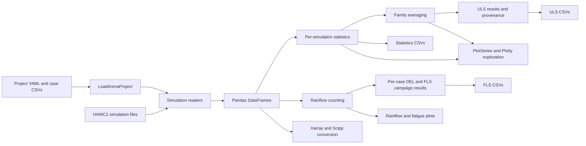

# Load Arena tool design

## Goal

Load Arena post-processes wind-turbine aeroelastic simulation results through a
reusable Python API. Version 1.0 focuses on HAWC2 campaign workflows for
statistics, family averaging, ultimate loads, fatigue loads, rainflow counting,
DEL calculation, provenance, CSV output, and interactive exploration.

## Current architecture

The supported high-level entry point is `LoadArenaProject`. It validates a YAML
project and its case CSVs, resolves paths, and invokes the existing processing
modules without embedding engineering calculations in the configuration layer.

## Package responsibilities

- `project` validates project configuration and orchestrates enabled analyses.
- `data_reader` reads HAWC2 data, provides a direct QBlade reader, and converts
  DataFrames to Xarray or Scipp datasets.
- `case_loader` validates the ULS and FLS case-table schemas.
- `process` owns statistics, family averaging, ULS, rainflow, DEL, and FLS
  calculations and their result objects.
- `visualization` converts calculated results into Plotly figures without
  rereading simulations or recalculating engineering values.
- `utils` contains channel, file-discovery, occurrence, and wind-distribution
  helpers.
- `AI` contains experimental tool-calling scripts and is not part of the core
  project workflow.

## Data and provenance model

Pandas DataFrames are the common internal table representation. Readers retain
channel metadata, while statistics, family, ULS, and FLS result objects preserve
source paths and row identity for traceability.

User-facing Plotly labels and hover text show filename basenames. Full original
paths remain unchanged in result objects and Plotly metadata so later actions can
locate the source simulation.

Family and ULS provenance distinguishes exact governing simulations from
aggregated or tied results. FLS retains unbinned rainflow cycles in memory so DEL
variants and plots can reuse one count.

## Supported simulation scope

- HAWC2 is supported by the project-based campaign API.
- QBlade has a direct reader but is not supported by `LoadArenaProject`.
- Bladed and OpenFAST readers are not implemented.

## Extension boundaries

New readers should normalize data and metadata before processing. New analyses
should live in `process`, expose explicit result objects, and remain independent
from project configuration and visualization. Plotting additions should consume
stored results and preserve full-path metadata rather than rerunning analyses.

Version 1.0 does not include load extrapolation, blade-load roses, RAOs,
frequency detection, Markov-matrix analysis, or new DEL methods. Those require
separate feature design and validation.
