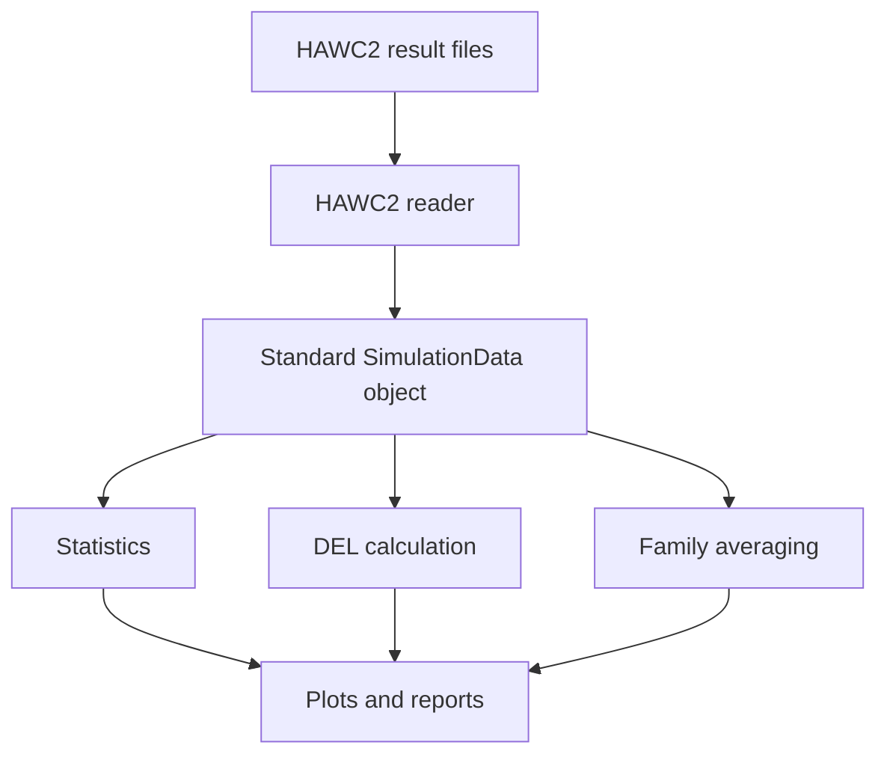

# Load Arena Tool Design

## Goal
Load Arena is a Python tool for post-processing wind turbine aeroelastic simulation results based on IEC 61400 workflows.

## Main workflow

Input simulation results → data reader → processing → visualization/reporting.

## First supported simulation software
- HAWC2
- 
## Later supported software

- Bladed
- OpenFAST
- QBlade

## First processing features

- Simple statistics
- Damage equivalent load
- Family averaging

## Later features

- Ranking plots
- Report generation
- Machine learning based prediction/forecasting

## Internal data model

The reader should convert raw simulation output into a common data structure used by the rest of the tool.