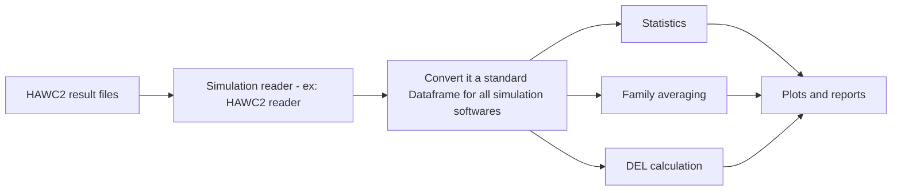
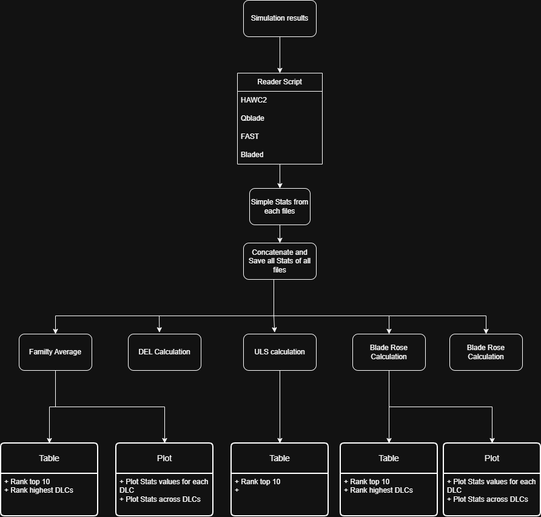

# Load Arena Tool Design

## Goal
Load Arena is a Python tool for post-processing wind turbine aeroelastic simulation results based on IEC 61400 workflows.

## Main workflow

Input simulation results → data reader → processing → visualization/reporting.

## First supported simulation software
- HAWC2

## Later supported software

- Bladed
- OpenFAST
- QBlade

## First processing features

- Simple statistics
- Family averaging
- Extreme load calculation among all Load Cases
- Damage equivalent load using Rainflow counting

## Later features

- Ranking plots
- Report generation
- Machine learning based prediction/forecasting
- Blade Load rose
- Blade Load Duration Damage (LDD)
- 

## Internal data model

The reader should convert raw simulation output into a common data structure used by the rest of the tool.

## Flowchart of the tool:

